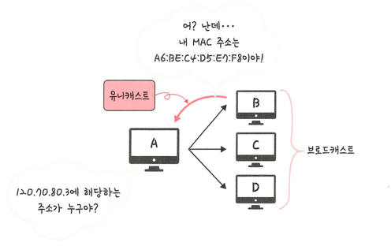

## ARP
> IP 주소로부터 MAC 주소를 구하는 IP와 MAC 주소의 다리 역할을 하는 프로토콜
> 
> > 가장 주소인 IP 주소 -> 실제 주소인 MAC 주소로 변환
> > 
> > RARP를 통해 실제 주소인 MAC -> 가상 주소로 변환

- MAC 주소
  - 각 장비를 유일하게 식별하기 위한 하드웨어 주소
  - 네트워크 카드(NIC, 랜카드)에 물리적으로 할당된 고유 식별자
  

### 시나리오
> 1. 장치 A가 ARP Request 브로드캐스트를 보내 IP 주소에 해당하는 MAC 주소 찾음
> 2. 해당 주소에 맞는 장치 B가 ARP Reply 유니캐스트를 통해 MAC 주소 반환
- 브로드캐스트
  - 송신 호스트가 전송한 데이터가 네트워크에 연결된 모든 호스트에 전송되는 방식
- 유니캐스트
  - 고유 주소로 식별된 하나의 네트워크 목적지에 1:1로 데이터를 전송하는 방식