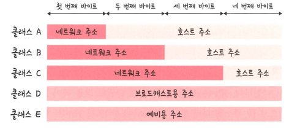
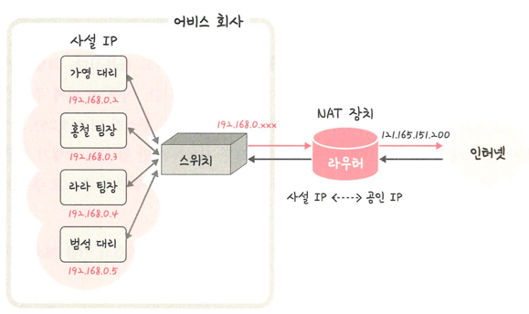

## IPv4/IPv6
> IPv4: 32비트, 8비트 단위로 점 찍어 표기
> > 123.45.67.89

> IPv6: 64비트, 16비트 단위로 점 찍어 표기
> > 2001:db8::ff00:42:8329

### 클래스 기반 할당 방식

> 앞에 있는 부분을 네트워크 주소, 뒤에 있는 부분을 호스트 주소로 놓아서 사용
> > 클래스 A,B,C: 일대일 통신으로 사용
> >
> > 클래스 D: 멀티캐스트 통신
> >
> > 클래스 E 예비용 주소
- 클래스 A 범위: 0.0.0.0 ~ 127.255.255.255
- 클래스 B 범위: 128.0.0.0 ~ 191.255.255.255
- 클래스 C 범위: 192.0.0.0 ~ 223.255.255.255
- 네트워크 구별 주소.호스트 주소.호스트 주소.브로드캐스트 주소

### DHCP
> IP 주소 및 기타 총신 매개변수를 자동으로 할당하기 위한 네트워크 관리 프로토콜
> > 네트워크 장치의 IP 주소를 수동으로 설정할 필요 없이 자동으로 IP 주소 할당

### NAT(Network Address Translation)
> 패킷이 전송되는 동안 IP 주소(및 필요 시 포트 번호)를 변환하여 사설망과 공인망 사이의 주소 매핑을 수행하는 기술
> > 공인 IP, 사설 IP로 나눠서 많은 주소 처리

- 동작: 내부IP:포트 → NAT 장치가 공인IP:다른포트로 바꿔 전송. 응답은 NAT 테이블을 보고 다시 내부 호스트로 전달.
#### NAT 사용 이유
- 여러 대의 내부(사설) 호스트가 하나 또는 소수의 공인 IP로 인터넷에 접속할 수 있게 하여 IPv4 주소를 절약
- ex) 1대의 공유기를 5명이 사용하여 인터넷을 사용 할 수 있음
- 하지만 많이 사용할 수록 속도가 느려짐
