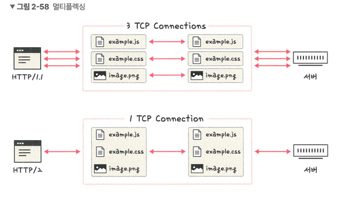
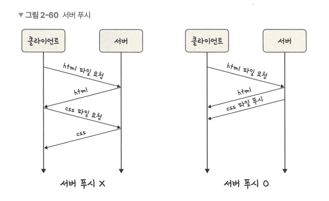

## HTTP/2
> HTTP/1.x보다 지연 시간을 줄이고 응답 시간을 더 빠르게 했음. TCP 위에서 돌아감
> > 멀티플렉싱, 헤더 압축, 서버 푸시, 요청 우선순위 처리 지원

### 멀티플렉싱
> 여러개의 스트림을 사용하여 송수신한다는 것
> > 특정 스트림의 패킷이 손실돼도 해당 스트림에만 영향을 미침. 나머진 정상 작동

- 애플리케이션에서 받아온 메시지를 독립된 프레임으로 조각내어 서로 송수신 후 다시 조립하여 데이터를 주고 받음
- 단일 연결을 사용하여 병렬로 여러 요청 및 응답 가능
- HOL Blocking 해결

### 헤더 압축
> 크기가 큰 헤더를 해결하기위해 나온 방법
> > 허프만 코딩 압축 알고리즘 사용하는 HPACK 압축 형식 가짐

- 허프만 코딩
  - 문자열을 문자 단위로 쪼개 빈도수를 센다.
  - 빈도가 높은 정보는 적은 비트 수를 사용하여 표현
  - 빈도가 낮은 정보는 비트 수를 많이 사용하여 표현
  - 즉 전체 데이터의 표현에 필요한 비트양을 줄이는 원리

### 서버 푸시
> 클라이언트 요청 없이 서버가 바로 리소스를 푸시할 수 있음

- html에는 css나 js 파일이 포함되기 마련인데 html을 읽으면서 그 안에 들어 있던 css 파일을 서버에서 푸시하여 클아이언트에 먼저 줄 수 있음.