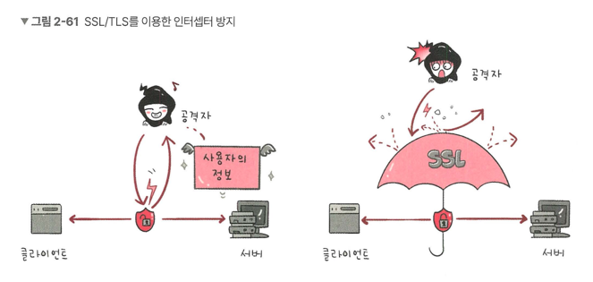
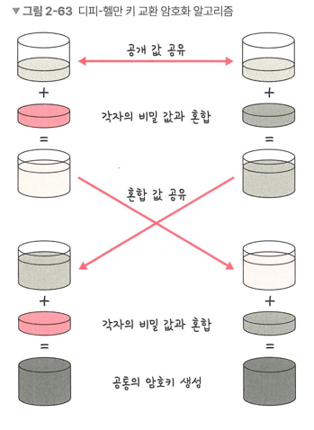

## HTTPS
> 애플리케이션, 전송 계층 사이에 신뢰 계층인 SSL/TLS 계층을 넣은 신뢰할 수 있는 HTTP 요청
> > 통신을 암호화 함

### SSL/TLS
> 전송 계층에서 보안을 제공하는 프로토콜
> > 클라이언트 - 서버 통신 간 SSL/TLS를 통해 제3자가 메시지 도처 및 변조 방지

- 보안 세션을 기반으로 데이터 암호화하며 보안 세션이 만들어짐.
- 인증 메커니즘, 키 교환 암호화 알고리즘, 해싱 알고리즘 사용 
#### 보안 세션
- 보안이 시작되고 끝나는 동안 유지되는 세션
- SSL/TLS는 핸드셰이크를 통해 생성하고 이를 기반으로 상태 정보 등을 공유

#### 인증 메커니즘
- CA에서 발급한 인증서를 기반으로 이루어짐.
- 공개키를 클라이언트에 제공하고 사용자가 접속한 서버가 **신뢰할 수 있는 서버** 를 보장
- 인증서는 서비스 정보, 공개키, 지문, 디지털 서명 등으로 이루어져 있음

#### 암호화 알고리즘
- 대수곡선 기반의 ECDHE, 모듈식 기반의 DHE를 사용. 둘다 디피-헬만 방식을 근간으로 만들어짐. 

#### 디피-헬만 공식 : y = g^x mod p
> > g와 x와 p를 알면 y는 구하기 쉽지만 g와 y와 p만 알면 x를 구하기 어렵다는 원리

- 클라이언트 서버 모두 개인키와 공개키를 생성
- 서로에게 공개키를 보냄
- 공개키 + 개인키를 결합하여 PSK 생성(공통의 암호 키)
- 공격자는 개인키 or 공개키를 가져도 PSK가 없기 때문에 아무것도 못함

#### 해싱 알고리즘
> 데이터를 추정하기 힘들게 작고 섞여 있는 조각으로 만드는 알고리즘
> >SHA-256, SHA-384 알고리즘 사용

- SHA-256 알고리즘
  - 해시 함수의 결과값이 256비트인 알고리즘
  - 해싱을 해야 할 메시지에 1을 추가하는 등 전처리를 하고 전처리된 메시지를 기반으로 해시를 반환

### HTTPS 구축 방법
- 직접 CA에서 구매한 인증키를 기반으로 서비스 구축
- 서버 앞단의 HTTPS를 제공하는 로드밸런서 두기
- 서버 앞단에 HTTPS를 제공하는 CDN을 둬서 구축