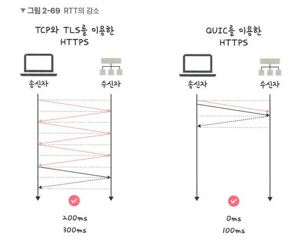

## HTTP/3
> QUIC 계층 위에서 UDP 기반으로 돌아감
> > 멀티플렉싱을 가지고 있으며, 초기 연결 설정 시 지연 시간 감소라는 장점 존재

### 초기 연결 설정 시 지연 시간 감소
- QUIC은 TCP를 사용하지 않기 때문에 3-way-handshake 과정 불필요 -> RTT 감소

- 첫 연결 시 1-RTT만 소요
- 순방향 오류 메커니즘 적용
  - 전송한 패킷이 손실되었다면 수신 측에서 에러를 검출하고 수정하는 방식
  - 열악한 네트워크 환경에서도 낮은 패킷 손실률 자랑