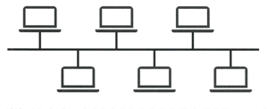
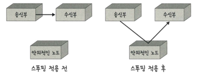
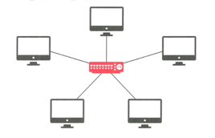
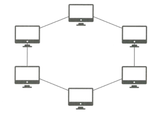
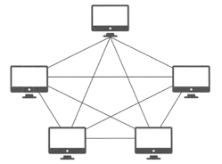

## 네트워크 토폴로지
> 노드와 링크가 어떻게 배치되어 있는지에 대한 방식/연결 형태
- 병목 현상을 찾을 때 중요한 기준이 됨

### 병목 현상
- 하나의 구성 요소로 인해 제한을 받는 현상

### 트리(계층형) 토폴로지
- 트리 형태로 배치한 네트워크 구성
- 노드 추가, 삭제가 쉬움
- 특정 노드에 트래픽이 집중될 때 하위 노드에 영향을 끼칠 수 있음.

### 버스 토폴로지
- 중앙 통신 회선 하나에 여러 개의 노드가 연결되어 공유

  
- LAN 에서 사용
- 장점
    - 설치 비용 적음
    - 신뢰성 우수
    - 중앙 통신 회선에 노드 추가/삭제 쉬움
- 단점
    - 스푸핑 위험 존재
      

### 스타(성형) 토폴로지
- 중앙에 있는 노드에 모두 연결된 네트워크 구성
  
- 장점
    - 노드 추가, 에러 탐지 쉬움
    - 패킷 충돌 발생 가능성 적음
    - 어떠한 노드에 장애가 발생했는지 쉽게 발견 가능
    - 다른 노드에 영향을 끼치는 것이 적음
- 단점
    - 중앙 노드에 장애 발생 -> 전체 네트워크 사용 불가 -> 설치 비용 고가

### 링형 토폴로지
- 각각의 노드가 양 옆의 두 노드와 연결된 네트워크 구성

  
- 데이터는 노드 -> 노드로 이동하며 길을 통해 패킷을 처리
- 장점
    - 노드 수가 증가되어도 네트워크상 손실 거의 없음
    - 충돌 발생 가능성 적음
    - 노드의 고장 발견을 쉽게 찾을 수 있음
- 단점
    - 네트워크 구성 변경이 어려움
    - 회선에 장애 발생 -> 전체 네트워크에 영향을 끼침

### 메시(망형) 토폴로지
- 그물망처럼 연결되어 있는구조

  
- 장점
    - 한 장치에 장애가 발생해도 여러개의 경로로 네트워크 계속 사용
    - 트래픽 분산 처리 가능
- 단점
    - 노드의 추가가 어려움
    - 구축/운영 비용 고가

