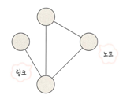
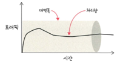

## 네트워크
> 노드와 링크가 서로 연결되어 리소스를 공유하는 집합

- 노드: 서버, 라우터 등 네트워크 장치를 의미
- 링크: 유선 or 무선

### 처리량
> 링크 내에서 성공적으로 전달된 데이터의 양
> > 즉 얼만큼의 트래픽을 처리했는지를 의미

- 사용자들의 많은 접속, 네트워크 간의 에러, 하드웨어 스펙에 영향을 받음

### 지연 시간
> 요청이 처리되는 시간을 말함
>> 하나의 메시지가 두 장치를 사이를 왕복하는 데 걸린 시간

- 매체 타입, 패킷 크기, 라우터의 패킷 처리 시간에 영향을 받음