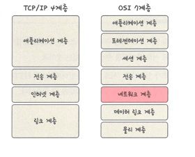

## TCP/IP 4계층 vs OSI 7계층 계층 구조

### 애플리케이션 계층
> HTTP, SSH 등 응용 프로그램이 사용되는 프로토콜 계층
> > 웹 서비스, 이메일 등 서비스를 실질적으로 사람들에게 제공하는 층

### 전송 계층
> 송싱자, 수신자를 연결하는 통신 서비스 제공
> 
> 연결 지향 데이터 스트림 지원, 신뢰성, 흐름 제어 제공
> 
> 애플리케이션과 인터넷 계층 사이의 중계 역할
> > TCP/UDP
- TCP 
  - 패킷 사이의 순서 보장
  - 수신 여부를 확인하며 '가상회성 패킷 교환 방식' 사용 -> 신뢰성 구축
- UDP
  - 순서 보장 X
  - 단순히 데이터만 주는 '데이터그램 패킷 교환 방식' 사용