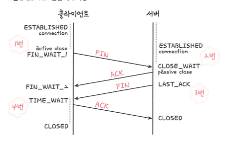

## TCP/IP 4계층 vs OSI 7계층 계층 구조

### 애플리케이션 계층
> HTTP, SSH 등 응용 프로그램이 사용되는 프로토콜 계층
> > 웹 서비스, 이메일 등 서비스를 실질적으로 사람들에게 제공하는 층

### 전송 계층
> 송싱자, 수신자를 연결하는 통신 서비스 제공
> 
> 연결 지향 데이터 스트림 지원, 신뢰성, 흐름 제어 제공
> 
> 애플리케이션과 인터넷 계층 사이의 중계 역할
> > TCP/UDP
- TCP 
  - 패킷 사이의 순서 보장
  - 수신 여부를 확인하며 '가상회성 패킷 교환 방식' 사용 -> 신뢰성 구축
  - > 각 패킷에 가상회선 식별자가 포함 -> 모든 패킷을 전송하면 가상회선이 해제 -> 전송된 *순서대료* 도착하는 방식
- UDP
  - 순서 보장 X
  - 단순히 데이터만 주는 '데이터그램 패킷 교환 방식' 사용
  - > 패킷이 독립적으로 최적의 경로를 선택하며 이동 -> 패킷들은 각자 다른 경로로 이동 -> 도착한 순서 다를 수도 있음

### 3-way-handshake

#### TCP 연경 성립 과정
1. SYN 단계: 클라이언트는 서버에 ISN을 담아 SYN을 보냄
2. SYN + ACK 단계: 서버는 클라이언트의 SYN을 수신하고 서버의 ISN을 보내며 승인번호로 ISN + 1을 보냄
3. ACK 단계: ISN + 1 값인 승인번호를 담아 ACK를 서버에 보냄
- 이 과정 이후 신뢰성이 구축되어 데이터 전송 시작
- TCP는 3-way-handshake를 하기 때문에 신뢰성이 있는 계층임

#### TCP 연결 해제 과정

1. 클라이언트는 연결을 닫기 위해 FIN으로 설정된 세그먼트를 보냄 -> FIN_WAIT_1 상태에서 서버의 응답을 기다림
2. 서버는 클라이언트로 승인 세그먼트 ACK를 보냄 -> 서버는 CLOSE_WAIT 상태에 들어감, 클라이언트는 FIN_WAIT_@ 상태에 들어감
3. ACK를 보낸 후 일정 시간 이후에 클라이언트에 세그먼트 FIN을 보냄
4. 클라이언트는 **TIME_WAIT** 상태가 되고 서버로 ACK를 보내며 서버는 CLOSE 상태가 된다
5. 일정 시간 대기 후 연결이 닫히고 클라이언트와 서버의 자원 연결이 해제됨

#### 일정시간 대기 후 닫는 이유
1. 지연패킷이 발생할 경우 대비: 패킷이 뒤늦게 도달하고 처리하지 못하면 데이터 무결성 문제 발생
2. 두 장치가 연결이 닫혔는지 확인하기 위해: 만약 ACK 상태에서 닫히게 되면 다시 새로운 연결을 하려고 할 때 마지막 ACK로 되어 있기 때문에 접속 오류가 나타남.