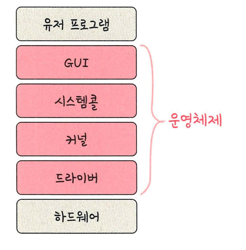
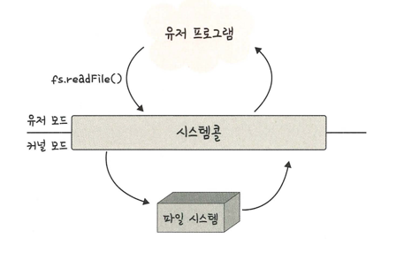
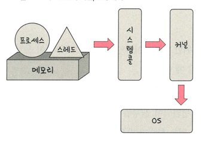

## 운영체제의 역할

> 1. CPU 스케줄링과 프로세스 관리: CPU 소유권을 어떤 프로세스에 할당할지, 프로세스 생성/삭제, 자원 할당/반환 처리
> 2. 메모리 관리: 한정된 메모리를 어떤 프로세스에 얼만큼 할당해야 할지
> 3. 디스크 파일 관리: 디스크 파일을 어떠한 방법으로 보관할지
> 4. I/O 디바이스 관리: I/O 디바이스들인 마우스/키보드와 컴퓨터 간에 데이터를 주고받는 것
> 5. 보호와 보안: 프로세스 간 간섭 차단, 권한 없는 접근 방지

## 운영체제 구조

- GUI: 단순 명령어 창이 아닌 아이콘을 마우스로 클릭하는 단순한 동작으로 컴퓨터와 상호 작용할 수 있게 해준다.
- 드라이버: 하드웨어를 제어하기 위한 소프트웨어
- CUI: 그래픽이 아닌 명령어로 처리하는 인터페이스(리눅스)

### 시스템 콜

> 응용 프로그램이 운영체제 서비스를 요청할 때 사용하는 인터페이스
- 예: 파일 열기(open), 프로세스 생성(fork), 입출력(read/write)
- 동작 과정:
    1. 사용자 프로그램이 I/O 요청 → 트랩 발생
    2. 커널 모드로 전환 → 요청이 유효한지 확인
    3. 커널이 서비스 수행 후 결과 반환
- 목적: 응용 프로그램이 하드웨어에 직접 접근하지 못하도록 보호

- 이렇게 프로세스/스레드 에서 운영체제로 요청을 할 때 시스템콜이라는 인터페이스와 커널을 거쳐 운영체제에 전달됨
- 시스템콜은 하나의 추상화 계층 -> 네트워크 통신/DB와 같은 낮은 단계떄 많이 사용