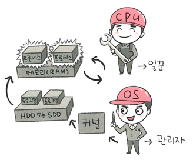

## CPU
> 산술논리연산장치, 제어장치, 레지스터로 구성
> 
> 인터렙트에 의해 메모리에 존재하는 명령어 해석해서 실행하는 일꾼
> > 커널이 프로그램을 메모리에 올려 프로세스 만든 것을 처리
> > 
### 제어장치
- 프로세스 조작을 지시
- 입출력장치 간 통신 제어
- 명령어들 읽고 해석하며 데이터 처리 순위 결정

### 레지스터
- 매우 빠른 임시기억장치
- CPU와 직접 연결되어 연산 속도가 메모리보다 수십~백배 빠름
- CPU는 자체적으로 데이터를 저장할 방법이 없기 때문에 레지스터를 거쳐 데이터 전달

### 산술논리연산장치
- 두 숫자의 산술 연산과 배타적 논리합, 논리곱 같은 논리 연산을 계산하는 디지털 회로

### CPU의 연산 처리
1. 제어장치가 메모리/레지스터에 계산할 값 로드
2. 제어장치가 레지스터에 있는 값을 계산하라고 산술논리연산장치에 명령
3. 제어장치가 계산된 값을 다시 '레지스터에서 메모리로'계싼한 값 저장

### 인터럽트
- 신호가 들어왔을 때 CPU를 잠깐 정지시키는 것
- I/O 디바이스로 인한 하드웨어 인터럽트 
- 프로세스 오류 등으로 시스템콜을 호출할 때 발생하는 소프트웨어 인터럽트(트랩)
- 인터럽트 발생 -> 인터럽트 핸들러 함수 실행
- 인터럽트 간에 우선순위 존재, 우선순위에 따라 실행됨

### 메모리
- 전자회로에서 데이터나 상태, 명령어 등을 기록하는 장치
- CPU는 계산을 담당/메모리는 기억을 담당

### 타이머
- 특정 프로그램의 끝나는 시간을 정의함
- 시간이 많이 걸리는 프로그램이 작동할 때 제한을 검
