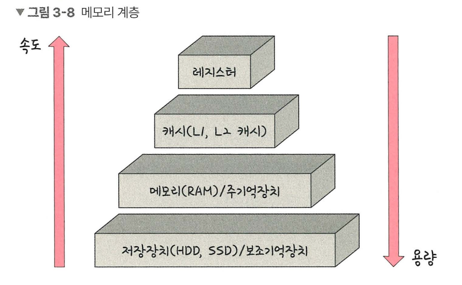
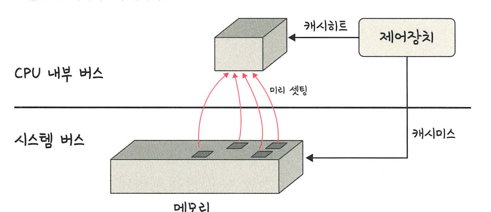

## 메모리 계층

> 레지스터, 캐시, 메모리, 저장장치로 구성
> > 레지스터: CPU 안에 있는 작은 메모리, 휘발성/속도 빠름, 기억 용량이 가장 적음
> >
> > 캐시: L1,L2 캐시 지칭. 휘발성, 숙도 빠름, 기억 용량 적음
> >
> > 주기억장치: RAM을 가리킴. 휘발성/속도 보통/기억 용량 보통
> >
> > 보조기억장치: HDD, SSD. 비휘발성, 속도 낮음/ 기억 용량 많음
- 계층 위로 올라갈수록 비싸짐/용량 작아짐/속도 빨라짐
  - 16gb RAM - 8만원/ 500GB SDD - 10만원
### RAM
- 하드디스크로부터 일정량의 데이터를 복사 -> 임시 저장 -> 필요 시 CPU에 빠르게 전달

### 캐시
> 데이터를 미리 복사해 놓는 임시 저장소
>
> 빠른 장치, 느린 장치에서 속도 차이에 따른 병목 현상을 줄이기 위한 메모리
> > 데이터를 접근하는 시간이 오래 걸리는 경우 해결.
> >
> > 다시 계산하는 시간 절약

### 캐시히트/미스
> 캐시히트: 캐시에서 원하는 데이터를 찾음
> 
> 캐시미스: 해당 데이터가 주메모리로 가서 데이터를 찾아오는 것(캐시에 없음)
> 

- 캐시히트시 해당 데이터를 제어장치를 거쳐 가져옴
  - 위치 가까움/CPU 내부 버스를 기반으로 작동 -> 빠름
  
- 캐시미스시 메모리에서 가져와야함 -> 시스템 버스 기반 -> 느림

#### 캐시매핑
> 캐시가 히트되기 위해 매핑하는 것
> > 레지스터 크기 <<<< RAM 크기 -> 작은 레지스터가 캐시 계층으로써 역할을 잘 해 주려면 매핑을 어떻게 하느냐가 중요

1.	직접 매핑 (Direct Mapping)
- 메모리 블록을 특정 캐시 라인에 1:1로 대응
- 빠르지만 충돌(같은 위치에 여러 데이터 매핑)이 잦음
2.	연관 매핑 (Associative Mapping)
- 메모리 블록을 어느 캐시 라인에도 저장 가능
- 충돌 적음, 하지만 검색 시 모든 캐시 라인을 탐색해야 해서 느림
3.	집합 연관 매핑 (Set Associative Mapping)
- 직접 매핑 + 연관 매핑 절충
- 캐시를 여러 집합(set)으로 나누고, 각 집합 안에서는 자유롭게 저장
- 충돌 줄이고 검색 효율성도 개선

#### 웹 브라우저의 캐시
> 쿠키, 로컬/세션 스토리지 존재
> > 사용자의 커스텀 정보 및 인증 모듈 관련들을 웹 브라우저에 저장해서 서버에 요청할 때 신원증명 및 중복 요청 방지를 위해 사용

#### 쿠키
> 만료기한이 있는 키-값 저장소
> 
> 4KB까지 데이터 저장 가능/만료기한 정할 수 있음(보통 서버에서 정함)

#### 로컬 스토리지
> 만료기한이 없는 키-값 저장소
> 
> 10MB까지 저장 가능/웹 닫아도 유지/도메인 단위로 저장 및 생성
> 
> 클라이언트에서만 수정 가능

#### 세션 스토리지
> 만료기한이 없는 키-값 저장소
> 
> 탭 단위로 생성/탭 닫을 때 데이터 삭제/클라이언트에서만 수정 가능
> 
> 5MB까지 저장 가능