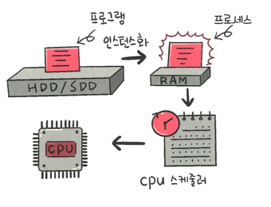
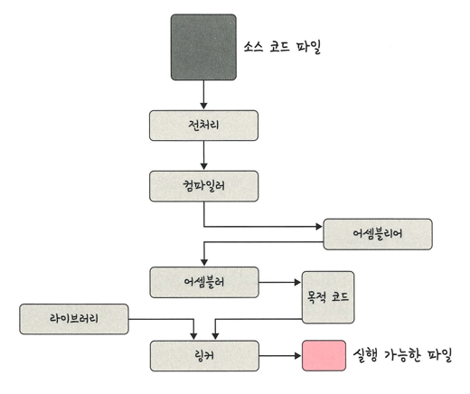

## 프로세스와 스레드
- 프로세스
  - 컴퓨터에서 실행되고 있는 프로그램
  - CPU 스케줄링의 대상이 되는 작업
- 스레드
  - 프로세스 내 작업의 흐름을 지칭

  - 프로그램이 메모리에 올라가면 프로세스가 되는 인스턴스화 발생
  - 이후 운영체제의 CPU 스케줄러에 따라 CPU가 프로세스를 실행

### 프로세스와 컴파일 과정
> 프로세스는 프로그램이 메모리에 올라가 인스턴스화된 것을 말함
> > 프로그램: 구글 크롬 프로그램(chrome.exe)와 같은 실행 파일
> >
> > 프로그램을 두 번 클릭하면 구글크롬 프로세스로 변환됨

#### 전처리
> 소스 코드의 주석을 제거하고 헤더 파일을 병합하여 매크로를 치환

#### 컴파일러
> 오류 처리, 코드 최적화 작업을 하며 어셈블리어로 변환

#### 어셈블러
> 어셈블리어는 목적 코드로 변환

#### 링커
> 프로그램 내에 있는 라이브러리 함수 or 다른 파일들과 목적 코드를 결합하여 실행 파일을 만듦
> >.exe or .out 이라는 확장자를 갖는다.

#### 정적 라이브러리
> 프로그램 빌드 시 라이브러리가 제공하는 모든 코드를 실행 파일에 넣어 라이브러리를 사용
> > 장점: 시스템 환경 등 외부 의존도가 낮음
> >
> > 단점: 코드 중복 등 메모리 효율성이 떨어짐

#### 동적 라이브러리
> 프로그램 실행 시 필요할 때만 DLL 함수 정보를 통해 참조하여 라이브러리를 사용
> > 장점: 메모리 효율성에서 장점
> >
> > 단점: 외부 의존도가 높아짐