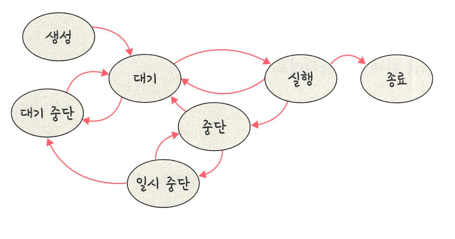

## 프로세스의 상태

#### 생성 상태
> 프로세스가 생성된 상태를 의미
> > fork(), exec() 함수를 통해 생성

- fork()
  - 부모 프로세스의 주소 공간을 그대로 복사
  - 새로운 자식 프로세스를 생성하는 함수
  - 비동기 작업 등은 상속하지 않음
-exec()
  - 새롭게 프로세슬르 생성하는 함수

#### 대기 상태
> 메모리 공간이 충분하면 메모리를 할당받음
> 
> 충분하지 않으면 아닌 상태로 대기
> 
> CPU 스케줄러부터 CPU 소유권이 넘어오기를 기다리는 상태

#### 대기 중단 상태
> 메모리 부족으로 일시 중단된 상태

#### 실행 상태
> CPU 소유권/메모리를 할당받고 인스트럭션을 수행 중인 상태를 의미
> > CPU burst가 일어났다고도 표현

#### 중단 상태
> 어떤 이벤트 발생한 후 기다리며 프로세스가 차단된 상태.
> > I/O 디바이스에 의한 인터럽트로 이런 현상이 많이 발생

#### 일시 중단 상태
> 중단된 상태에서 프로세스가 실행되려고 했지만 메모리 부족으로 일시 중단된 상태
> > 대기 중단과 유사

#### 종료 상태
> 메모리, CPU 소유권을 모두 놓고 가는 상태
> > 자연스럽게 종료
> >
> > 부모 프로세스가 자식 프로세스를 강제시키는 비자발적 종료
> > 
> > 자식 프로세스의 자원의 한계치를 넘어서거나 부모 프로세스가 종료되거나 사용자가 process.kll 등 명령어로 프로세스를 종료할 때 발생