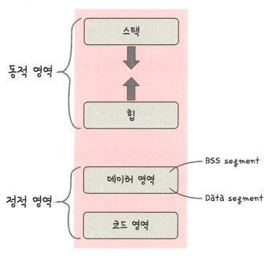

## 프로세스의 메모리 구조

#### 스택과 힙
> 스택과 힙은 동적할당이 됨
- 동적할당: 런타임 단계에서 메모리를 할당받는 것
- 스택: 지역/매개변수, 실행되는 함수에 의해 늘어들거나 줄어드는 메모리 영역
- 힙: 동적으로 할당되는 변수들을 담는다.
  - malloc(), free() 함수를 통해 관리할 수 있음
  - 동적으로 관리되는 자료 구조의 경우 힙 영역 사용

#### 데이터 영역과 코드 영역
> 정적 할당되는 영역
- 정적할당: 컴파일 단계에서 메모리를 할당하는 것
- BSS segment: 전역 변수 or static, const로 선언
  - 0으로 초기화 또는 어떠한 값으로도 되어 있지 않은 변수들이 이 메모리 영역에 할당
- Data segment: 전역 변수 or static, const로 선언
  - 0이 아닌 값으로 초기화된 변수가 이 메모리 영역에 할당
- code segment: 프로그램의 코드가 들어감