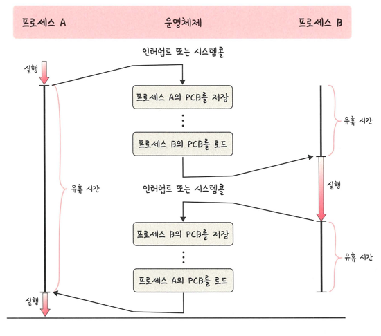

## PCB
> 운영체제에서 프로세스에 대한 메타데이터를 저장한 데이터 구조
> > 프로세스가 생성되면 운영체제는 해당 PCB를 생성
- 프로세스 주소 값 + 스택/힙 등의 구조를 기반으로 메모리가 할당 됨
- 이 프로세스의 메타데이터들이 PCB에 저장되어 관리됨
- 중요한 정보를 포함하고 있기 때문에 일반 사용자가 접근하지 못하도록 커널 스택의 가장 앞부분에서 관리

#### PCB의 구조
- 프로세스 스케줄링 상태: '준비', '일시중단' 등 프로세스가 CPU에 대한 소유권을 얻은 이후의 상태
- 프소세스 ID: 프로세스 ID, 해당 프로세스의 자식 프로세스 ID
- 프로세스 권한: 컴퓨터 자원 또는 I/O 디바이스에 대한 권한 정보
- 프로그램 카운터: 프로세스에서 실행해야 할 다음 명령어의 주소에 대한 포인터
- CPU 레지스터: 프로세스를 길행하기 위해 저장해야 할 레지스터에 대한 정보
- CPU 스케줄링 정보: CPU 스케줄러에 의해 중단된 시간 등에 대한 정보
- 계정 정보: 프로세스 실행에 사용된 CPU 사용량, 실행한 유저의 정보
- I/O 상태 정보: 프로세스에 할당된 I/O 디바이스 목록

#### 컨텍스트 스위칭
> PCB를 교환하는 과정
> > 프로세스에 할당된 시간이 끝나거나 인터럽트에 의해 발생
- 컨텍스트 스위칭 과정

1. 실행 중인 프로레스 A
   - CPU에서 A가 실행 중이다가 인터럽트 또는 시스템 콜이 발생
   - 운영체제는 현재 실행 상태를 보존해야 하므로 A의 PCB에 레지스터 값,프로그램 카운터, 메모리 정보 등 컨텍스트 저장
2. 새로운 프로세스 B 로드
   - 스케줄러가 CPU를 프로세스 B에게 할당하기로 결정한다.
   - 운영체제는 프로세스 B의 PCB를 메모리에서 읽어와 CPU 레지스터에 복원한다.
   - 이제 CPU는 프로세스 B의 실행 상태로 전환된다.
3. 프로세스 B 실행 → 다시 인터럽트 발생
   - 프로세스 B가 실행되다가 또 다른 인터럽트나 시스템 콜이 발생한다.
   - 운영체제는 동일한 절차로 프로세스 B의 PCB를 저장하고, 다른 프로세스(예: A)를 로드한다.
4. 프로세스 A 재개
   - 프로세스 A의 PCB를 다시 로드하면, 이전에 중단했던 지점부터 실행을 이어갈 수 있다.

