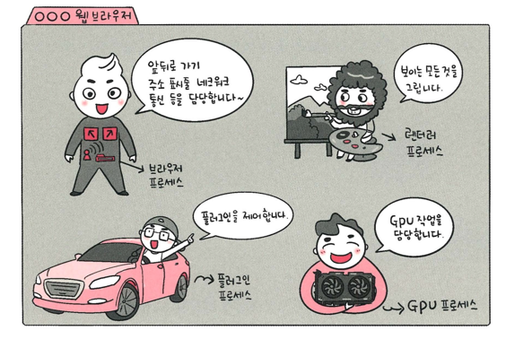
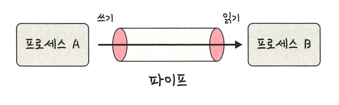
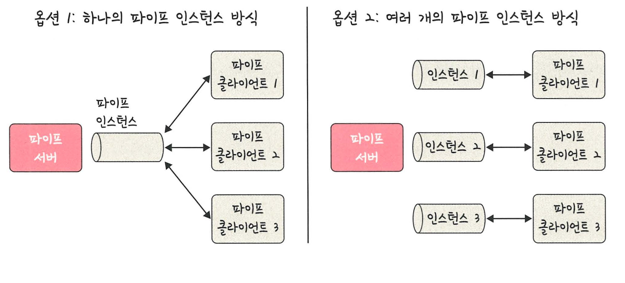

## 멀티프로세싱
> 여러 개의 프로세스를 통해 동시에 두 가지 이상의 일을 수행하는 것
> > 하나 이상의 일을 병렬로 처리할 수 있음
> >
> > 특정 프로세스의 문제가 발생되더라고 다른 프로세스를 이용하여 신뢰성이 높음

#### 웹 브라우저

- 브라우저 프로세스: 주소 표시줄, 북마크 막대, 앞/뒤로가기 버튼 담당
  - 네트워크 요청/파일 접근 같은 권한 담당
- 렌더러 프로세스: 웹 사이트가 보이는 부분의 모든 것을 제어
- 플러그인 프로세스: 웹 사이트에서 사용하는 플러그인을 제어
- GPU 프로세스: GPU를 이용해서 화면을 그리는 부분 제어

#### IPC
> 프로세스끼리 데이터를 주고받고 공유 데이터를 관리하는 메커니즘
> > ex) 클라이언트는 데이터를 요청하고 서버는 클라이언트 요청에 응답하는 과정

#### IPC의 종류
**공유 메모리**
> 여러 프로세스에 동일한 메모리 블록에 대한 접근 권한이 부여
> 
> 프로세스가 서로 통신할 수 있도록 공유 메모리를 생성해서 통신하는 것
- 공유메모리를 통해 여러 프로세스가 하나의 메모리를 공유할 수 있음
- 메모리 자체를 공유하기 때문에 불필요한 데이터 복사의 오버헤드가 발생하지 않음
- 가장 빠르며 같은 메모리 영역을 여러 프로세스가 공유하기 때문에 동기화 필요

**파일**
> 데이터 또는 파일 서버에서 제공한 데이터 이를 기반으로 프로세스 간 통신

**소켓**
>동일한 컴퓨터의 다른 프로세스 or 네트워크의 다른 컴퓨터로 네트워크 인터페이스를 통해 전송하는 데이터를 의미
> > TCP/UDP가 이에 해당

**익명 파이프**

> 프로세스 간에 FIFO 방식으로 읽히는 임시 공간인 파이프를 기반으로 데이터 주고받음
> > 단방향 방식의 읽기/쓰기 전용 파이프를 만들어서 작동하는 방식
> >
> > 부모,자식 프로세스 간에만 사용할 수 있음, 다른 네트워크상에서는 사용불가

**named 파이프**

> 파이브 서버와 하나 이상의 파이프 클라이언트 간의 통신을 위한 단/양방향 파이프
> > 클라이언트/서버 통신을 위한 별도의 파이프 제공, 여러 파이프 동시에 사용 가능
> >
> > 컴퓨터 프로세스 끼리 or 다른 네트워크상의 컴퓨터와도 통신할 수 있음

**메시지 큐**
> 메시지를 큐 구조 형태로 관리하는 것
> > 커널의 전역변수 형태 등 커널에서 전역적으로 관리
> >
> > 다른 IPC 방식에 비해서 사용 방법이 매우 직관적이고 간단
> >
> > 코드 수정 없이 단지 몇 줄의 코드를 추가시켜 간단하게 메시지 큐에 접근할 수 있음