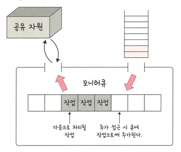

### 공유 자원
> 시스템 안에서 각 프로세스, 스레드가 함께 접근할 수 있는 자원이나 변수 등을 의미
> > 경재 상태: 공유 자원을 두 개 이상의 프로세스가 동시에 읽거나 쓰는 상황
> >
> > 동시에 접근하여 타이밍이나 순서 등이 결과값에 영향을 줄 수 있음
- 공유 자원 예시

- 동시에 접근하여 정상 결과값은 300인데 200이 출력

### 임계 영역
> 둘 이상의 프로세스, 스레드가 공유 자원에 접근할 때 순서등의 이유로 결과가 달라지는 코드 영역
> > 해결 방법: 뮤텍스, 세마포어, 모니터

#### 뮤텍스

> 프로세스/스레드가 공유 자원을 lock()을 통해 잠금 설정하고 사용한 후에는 unlock()을 통해 잠금 해제하는 객체
> > 잠금이 설정되면 다른 프로세스나 스레드는 잠긴 코드 영역에 접근 X 해제는 반대
> >
> > 잠금 or 잠금 해제 상태만 가짐

#### 세마포어

> 일반화된 뮤텍스로 간단한 정수 값과 wait, signal로 공유 자원에 대한 접근을 처리함
> 
> 멀티프로그래밍 환경에서 공유 자원에 대한 접근을 제한하는 방법
> > wait(P 함수): 자신의 차례가 올 때까지 기다리는 함수
> >
> > signal(V 함수): 다음 프로세스로 순서를 넘겨주는 함수
- 공유 자원에 접근하면 wait() 작업 수행
- 공유 자원을 해제하면 signal() 작업 수행
- 한 프로세스/스레드가 세마포어 값을 수행할 때 다른 프로세스/스레드는 값을 수정할 수 없음

#### 모니터

> 둘 이상의 스레드나 프로세스가 공유 자원에 안전하게 접근할 수 있도록 공유자원 숨김
> 
> 해당 접근에 대해 인터페이스만 제공

- 모니터큐를 통해 공유 자원에 대한 작업들을 순차적으로 처리
- 세마포어보다 구현하기 쉬움
  - 모니터에서 상호 배제는 자동
  - 세마포어에서는 상호 배제 명시적으로 구현해야함
