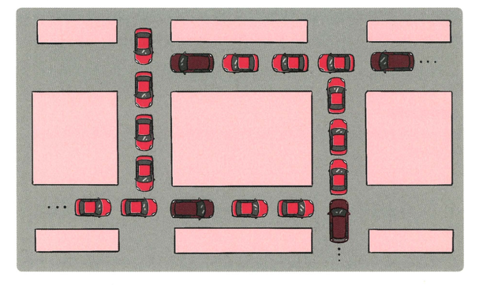

## 교착상태

> 두 개 이상의 프로세스들이 서로 가진 자원을 기다리며 중단된 상태

### 교착 상태 원인
- 상호 배제: 한 프로세스가 자원을 독점하여 다른 프로세스들은 접근이 불가능
- 점유 대기: 특정 프로세스가 점유한 자원을 다른 프로세스가 요청하는 상태
- 비선점: 다른 프로세스의 자원을 강제적으로 가져올 수 없음
- 환형 대기: A는 B의 자원을 요구하고 B도 A의 자원을 요청하는 상황

### 교착 상태 해결 방법
- 자원 할당할 때 원인이 성립되지 않도록 설계
- 은행원 알고리즘 사용
  - 교착 상태 가능성이 없을 때만 자원 할당되며, 요청할 자원들의 최대치를 통해 자원 할당 가능 여부 파악
- 교착 상태가 발생하면 사이클이 있는지 찾아보고 관련된 프로세스를 한 개씩 지움
- 현대 운영체제에서는 사용자가 작업 종료하는 방식 채택
  - '응답 없음'이라고 뜨는 경우 사용자가 종료