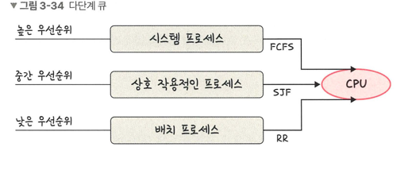

## 선점형 방식
> 실행 중인 프로세스를 중단시키고, 알고리즘에 따라 다른 프로세스에 CPU를 강제로 할당하는 방식
> > 현대 운영체제가 사용하고 있는 방식

### 라운드 로빈
> 각 프로세스는 동일한 할당 시간을 주고 그 시간 안에 끝나지 않으면 다시 준비 큐의 뒤로 가는 알고리즘
> > 우선순위 스케줄링의 일종
- q : 할당시간/ N: 프로세스의 개수
- (N - 1) * q 시간 후 다시 차례 도착
- q가 크면 FCFS가 되고 짧으면 컨텍스트 스위칭이 잦아져 오버헤드가 발생함
- 전체 작업 시간은 길어지지만 평균 응답 시간은 짧아짐
- 로드밸런서에서 트래픽 분산 알고리즘으로도 쓰임

### SRTF
> 중간에 더 짧은 작업이 들어오면 수행하던 프로세스를 중지하고 해당 프로세스를 수행

### 다단계 큐
> 우선순위에 따른 준비 큐를 여러개 사용
> > 큐마다 라운드 로빈, FCFS 등 다른 스케줄링 알고리즘을 적용한 것
> >
> > 큐 간 프로세스 이동이 안 되므로 스케줄링 부담이 적지만 유연성이 떨어짐
