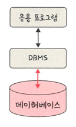

## 데이터베이스

> 일정한 규칙/규약을 통해 구조화되어 저장되는 데이터의 모음
> > DBMS: 데이터베이스를 제어, 관리하는 통합 시스템
> >
> > 데이터들은 정의된 쿼리 언어를 통해 삽입, 삭제, 수정, 조회 등을 수행할 수 있음
> > 
> > 실시간 접근과 동시 공유 가능

### 엔티티
> 사람, 장소, 물건, 사건, 개념 등 여러 개의 속성을 지닌 명사
> > ex) 회원- 이름, 아이디, 주소, 전화번호의 속성을 가짐

#### 약한/강한 엔티티
> A가 혼자서는 존재하지 못하고 B의 존재 여부에 따라 종속적이라면
> 
> A: 약한 엔티티 / B: 강한 엔티티