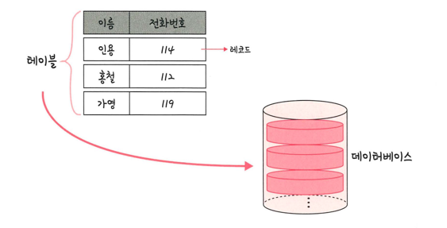

### 릴레이션

> DB에서 정보를 구분하여 저장하는 기본 단위
> > 엔티티에 관한 데이터를 DB는 릴레이션 하나에 담아서 관리
> >
> > 관계형 DB(MySQL): 테이블 이라고 함
> > - 레코드-테이블-DB 순
> > 
> > NoSQL DB(NoSQL): 컬렉션 이라고 함
> > - 도큐먼트-컬렉션-DB 순

- 이렇게 레코드가 쌓여 테이블, 테이블이 쌓여 DB가 됨

