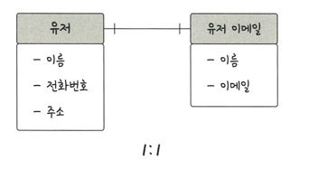
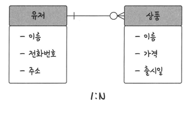
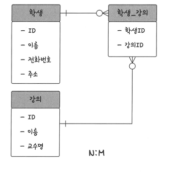

### 관계
> 테이블은 서로의 관계가 정의됨
> > - 1:1 관계: 유저당 유저 이메일은 1개
> >     
> >   - 테이블의 구조를 더 이해하기 쉽게 만들어줌 
> > - 1:N 관계: 유저당 여러 개의 상품
> > 
> > - N:M 관계: 학생도 강의를 많이듣고, 강의도 여러 명의 학생 포함
> > 
> >   - N:M 테이블은 두 개를 직접적으로 연결해서 구축하지 않음
> >   - 1:N, 1:M 관계 테이블 두 개로 나눠서 설계