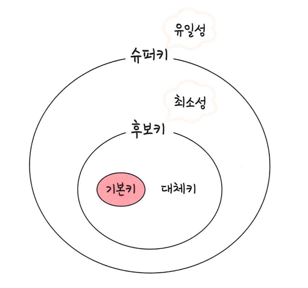
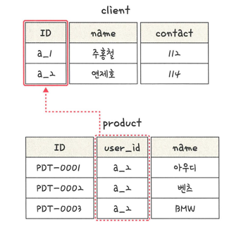

### 키
>테이블 간의 관계를 명확하게 함
> 
> 테이블 자체의 인덱스를 위해 설정된 장치

- 슈퍼키: 유일성 + 최소성
- 후보키중 기본키로 선택되지 못한 키가 대체키
- 유일성: 중복되는 값은 존재하지 않음
- 최소성: 필드를 조합하지 않고 최소 필드만 써서 키를 형성할 수 있음

#### 기본 키
> 유일성 + 최소성을 만족하는 키
> > ID가 중복되어서는 안됨
- 자연키
  - 중복된 값들을 제외하며 중복되지 않는 키 (주민등록번호)
  - 언젠가는 변하는 속성을 가짐
- 인조키
  - 인위적으로 유저 아이디를 부여하는 것
  - 보통 기본키는 인조키로 하며 변하지 않음
  - userId = UUID.randomId() 

#### 외래키

> 다른 테이블의 기본키를 그대로 참조하는 값
> > 외래키는 중복 허용

#### 후보키
> 기본키가 될 수 있는 후보들
> > 유일성 + 최소성을 만족하는 키

#### 대체키
> 후보키가 두 개 이상일 경우 하나는 기본키 남은 키들을 후보키

#### 슈퍼키
> 각 레코드를 유일하게 식별할 수 있는 유일성을 갖춘 키