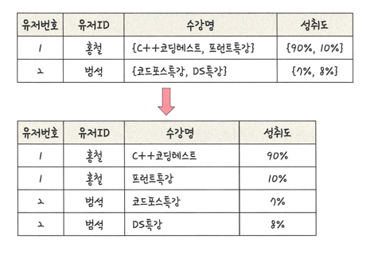
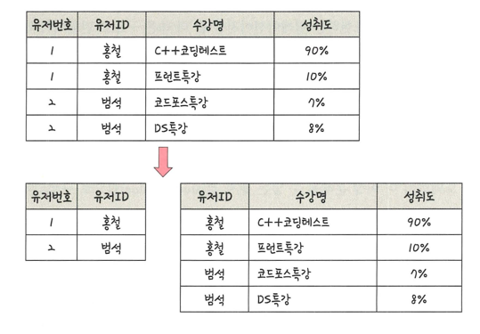
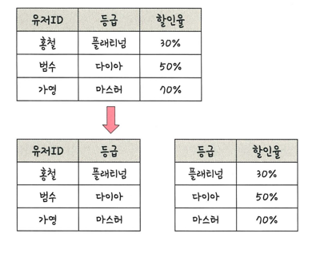
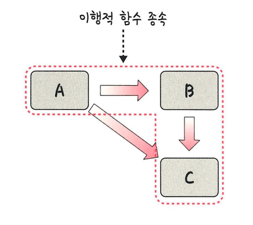
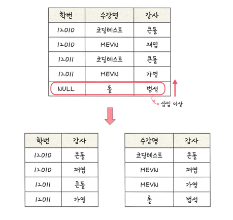

### 정규화 과정
> 릴레이션 간의 잘못된 종속 관계로 인해 데이터베이스 이상 현상이 일어나 이를 해결하거나, 저장 공간을 효율적으로 사용하기 위해 릴레이션을 여러 개로 분리하는 과정 
> > 데이터베이스 이상현상: 시스템 설계대로 데이터 읽기/쓰기가 안되는 현상
> > - 회원이 한 개의 등급을 가져야 하는데 세 개의 등급을 갖는 경우
> > - 이상한 데이터가 삭제되는 경우
> >
> > 정규형: 정규화된 정도를 표현

##### 정규형 원칙
> - 자료의 중복성 감소
> - 독립적인 관계는 별개의 릴레이션으로 표현
> - 각각의 릴레이션은 독립적인 표현이 가능해야 함

##### 제1정규형
> 모든 도메인이 더 이상 분해될 수 없는 원자 값만으로 구성되어야 한다
> > 속성 값 중에서 한 개의 기본키에 대해 두 개 이상의 값을 가지는 반복 집합이 있어서는 안된다.
> > 
> > 

#### 제2정규형
> 릴레이션이 제1정규형이며 부분 함수의 종속성을 제거한 형태
> > 부분 함수의 종속성 제거: 기본키가 아닌 모든 속성이 기본키에 완전 함수 종속적인 것을 말함
> >
> >

#### 제3정규형
> 릴레이션이 제2정규형이며 기본키가 아닌 모든 속성이 이행적 함수 종속을 만족하지 않는 상태
> >
> > 
> >
> > 이행적 함수 종속: A->B 와 B -> C 가 존재하면 노리적으로 A->C 가 성립하는데 이때 C가 A에 이행적으로 함수 종속이 되었다고 함.
> >
> > 
> > 

#### 보이스/코드 정규형
> 릴레이션이 제3정규형이고, 결정자가 후보키가 아닌 함수 종속 관계를 제거하여 모든 결정자가 후보키인 상태를 말함
> >
> > 
> > - 결정자: 함수 종속 관계에서 특정 종속자를 결정짓는 요소
> >   - X -> Y 일때 X는 결정자, Y는 종속자이다.

### 결론
> 정규화 과정을 거쳐 테이블을 나눠도 성능이 100% 좋아지는 것은 아님.
> 
> 테이블을 나눔으로써 어떠한 쿼리는 조인을 해야 하는 경우도 발생해서 느려질 수도 있음
> 
> 서비스에 따라 정규화 또는 비정규화 과정을 진행해야함 !
