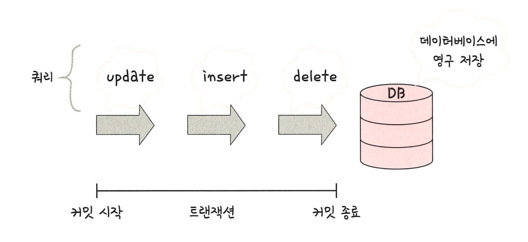
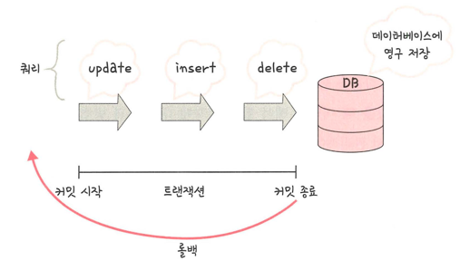
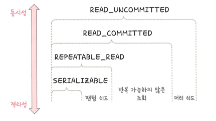

### 트랜잭션
> 데이터베이스에서 하나의 논리적 기능을 수행하기 위한 작업의 단위
> > 쿼리: 데이터베이스에 접근하는 방법
> >
> > 즉 여러 개의 쿼리들을 하나로 묶는 단위

### 원자성
> 트랜잭션과 관련된 일이 모두 수행 or 수행 되지 않은 경우를 보장하는 특징
- 예시: 송금
1. A의 잔고를 조회한다
2. A의 잔고에서 100만원을 뺀다
3. B에게 100만원을 넣는다
> 여기서 1,2,3 번의 과정이 모두 수행됐거나, 하나라도 수행되지 않으면 원래 상태로 되돌리는 것을 의미한다.

#### 커밋

> 여러 쿼리가 성공적으로 처리되었다고 확정하는 명령어
> >트랜잭션 단위로 수행되며 변경된 내용이 모두 영구적으로 저장
> >
> >커밋이 수행되었다 = 하나의 트랜잭션이 성공적으로 수행되었다.

#### 롤백

> 트랜잭션으로 처리한 하나의 묶음 과정을 일어나기 전으로 돌리는 일
> >에러/이슈 때문에 트랜잭션 전으로 돌려야 하는 상황일때 사용

> 커밋과 롤백 덕에 데이터의 무결성이 보장됨 
> 
> 데이터 변경 전에 변경 사항을 쉽게 확인할 수 있고 해당 작업을 그룹화 할 수 있음.

#### 트랜잭션 전파
> 여러 트랜잭션 관련 메서드의 호출을 하나의 트랜잭션에 묶이도록 하는 것
> > Spring 프레임워크에서는 @Transactional 어노테이션을 통해 처리

### 일관성
> 허용된 방식으로만 데이터를 변경해야 하는 것을 의미
> > 모든 데이터는 여러 가지 조건, 규칙에 따라 유효함을 가져야 함
- 예시
  - A는 100만원/ B는 10만원 가지고 있음
  - B가 A 한테 100만원을 송금할 수는 없음

### 격리성
> 트랜잭션 수행 시 서로 끼어들지 못하는 것
> > 복수의 병렬 트랜잭션은 서로 격리되어 동시에 실행되더라도 순차적으로 실행된 것과 동일한 결과를 보장해야 함
> >
> > DB는 여러 사용자가 같은 데이터에 접근할 수 있어야 함

### 격리 수준

> 위로 갈수록 동시성 강해짐/격리성 약해짐
> 
> 아래로 갈수록 동시성 약해짐/격리성 강해짐

#### SERIALIZABLE -> 모든 현상 방지 가능( 하지만 성능이 떨어짐)
> > 트랜잭션을 순차적으로 진행시키는 것
> > 여러 트랜잭션이 동시에 같은 행에 접근할 수 없음
> >
> >교착 상태가 일어날 확률도 많고, 성능이 떨어지는 격리 수준

#### REPEATABLE_READ -> 팬텀 리드 발생
> 하나의 트랜잭션이 수정한 행을 다른 트랜잭션이 수정할 수 없도록 막아주지만 새로운 행을 추가하는 것은 막지 않음

#### READ_COMMITTED -> 반복 가능하지 않은 조회
> 다른 트랜잭션이 커밋하지 않은 정보는 읽을 수 없음
> > 즉 커밋이 완료된 데이터에 대해서만 조회를 허용
> > 
> > 하지만 어떤 트랜잭션이 접근한 행을 다른 트랜잭션이 수정할 수 있음.
> >
> > 가장 많이 사용되는 격리 수준

#### READ_UNCOMMITTED -> 더티 리드 발생
> 하나의 트랜잭션이 커밋되기 이전에 다른 트랜잭션에 노출되는 문제가 있지만 가장 빠르다.
> > 무결성을 위해 되도록 사용 X
> > 
> > 하지만 몇몇 행이 제대로 조회되지 않더라도 괜찮은 거대한 양의 데이터를 '어림잡아' 집계할 때는 괜찮음

### 격리 수준에 따라 발생하는 현상

#### 팬텀 리드
> 한 트랜잭션 내에서 동일한 쿼리를 보냈을 때 조회 결과가 다른 경우

#### 반복 가능하지 않은 조회
> 한 트랜잭션 내의 같은 행에 두번 이상 조회가 발생했는데, 그 값이 다른 경우

#### 더티 리드
> 한 트랜잭션이 실행 중일 때 다른 트랜잭션에 의해 수정되었지만 아직 **커밋되지 않은** 행의 데이터를 읽을 수 있을 때 발생

### 지속성
> 성공적으로 수행된 트랜잭션은 시스템 장애가 발생하더라도 트랜잭션 결과는 보존되어야 함
> > 데이터베이스에 시스템 장애가 발생해도 원래 상태로 복구하는 회복 기능이 있어야 함
> >
> >체크섬, 저널링, 롤백 등의 기능을 제공