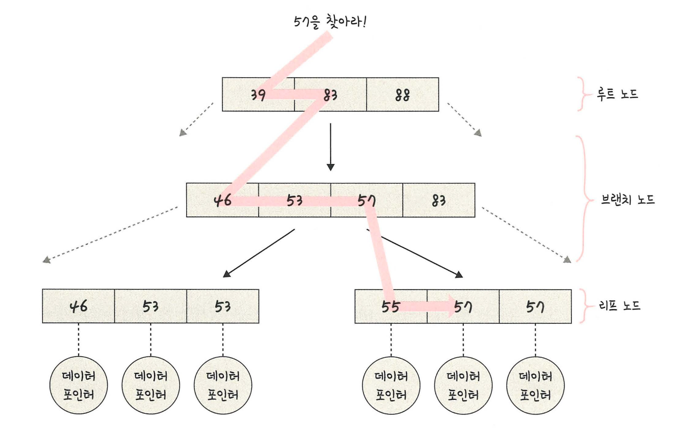
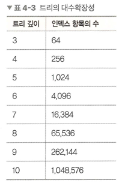

## B-트리
> 인덱스는 보통 B-트리라는 자료 구조로 이루어져 있음
> > 루트/브랜치/리프 노드로 나뉨
> 
> 
> - 57보다 같거나 클 때 까지 아래 노드로 탐색

### 인덱스가 효율적인 이유와 대수확장성
> 효율적인 단계를 거쳐 모든 요소에 접근할 수 있는 균형 잡힌 트리 구조와 트리 깊이의 대수확장성 때문
> > - 대수확장성: 트리 깊이가 리프 노드 수에 비해 매우 느리게 성장하는 것
> > - 인덱스가 한 깊이씩 증가할 때마다 최대 인덱스 항목의 수는 4배씩 증가
> >
> > 
> > - 100만 개 레코드를 깊이 10으로 가능