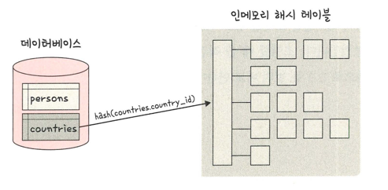

## 해시 조인
> 해시 테이블을 기반으로 조인하는 방법'
> > 두 개의 테이블을 조인한다고 했을 때 하나의 테이블이 메모리에 들어가면 더 효율적
> > 
> > 만약 메모리에 올릴 수 없을 정도로 크다면 디스크 사용하는 비용 발생 

### 빌드 단계
> 입력 테이블 중 하나를 기반으로 메모리 내 해시 테이블을 빌드하는 단계
> > persons / countries 테이블 조인 시 바이트가 더 작은 테이블을 기반으로 빌드
> > 
> > 또한 조인에 사용되는 필드가 해시 테이블의 키로 사용 즉 countries.country_id 가 키로 사용

### 프로브 단계
> 레코드 읽기 시작하며, 각 레코드에서 'persons.country_id' 에 일치하는 레코드를 찾아서 결과값으로 반환
> > 이를 통해 각 테이블은 한 번씩만 읽게 되어 중첩 루프 조인보다 보통 성능이 더 좋음